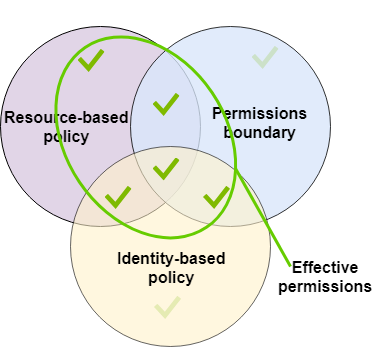

The flowchart from the AWS IAM [policy evaluation documentation page](https://docs.aws.amazon.com/IAM/latest/UserGuide/reference_policies_evaluation-logic.html), as of 2021-09-12, and dating back to at least [2018-12-27](https://web.archive.org/web/20181227013421/https://docs.aws.amazon.com/IAM/latest/UserGuide/reference_policies_evaluation-logic.html), is the following:

The flowchart indicates that an Allow in a resource policy causes a final decision of Allow, before permissions boundaries have a chance to cause an implicit Deny.
This would mean a resource policy could unilaterally grant access to a principal, circumventing its permissions boundary.
However, this is only partially correct.

Resource policies cannot unilaterally grant access to an IAM *role* but *can* unilaterally grant access to *particular role sessions*, that is, the thing that is created by calling `AssumeRole`. This is mentioned in the docs [here](https://docs.aws.amazon.com/IAM/latest/UserGuide/access_policies_boundaries.html#access_policies_boundaries-eval-logic), illustrated with the following diagram, though this information is excluded from subsequent diagrams about SCPs and session policies.

This is true for assumed role sessions created with `AssumeRole` (and presumably `AssumeRoleWithSAML` and `AssumeRoleWithWebIdentity`), where the principal in the resource policy is the assumed role session ARN, which is retrievable through the `GetCallerIdentity` API, which does not require permissions.

The documentation is unclear on IAM users. In adjacent paragraphs [here](https://docs.aws.amazon.com/IAM/latest/UserGuide/access_policies_boundaries.html#access_policies_boundaries-eval-logic), the documentation states:

> Within an account, an implicit deny in a permissions boundary *does not* limit the permissions granted to an IAM user by a resource-based policy.

> Within an account, an implicit deny in a permissions boundary *does* limit the permissions granted to the ARN of the underlying [...] IAM user by the resource-based policy.

It's possible the latter statement about an "IAM user" is actually about a *federated* user in an IAM role (using a "Federation" principal? Or is this about session through [GetFederationToken](https://docs.aws.amazon.com/STS/latest/APIReference/API_GetFederationToken.html)?

## Verification

For an IAM role with a permissions boundary, role policy, and resource policy, none with any `Deny`s, the possible combinations of `Allow`s in the policy have the following results:

### Role as resource policy principal
Permissions Boundary | Role Policy | Resource Policy | Result
--- | --- | --- | ---
\- | - | Allow | **Deny**
\- | Allow | Allow | **Deny**
Allow | Allow | - | Allow
Allow | - | Allow | Allow
Allow | Allow | Allow | Allow
Allow | - | - | Deny
\- | Allow | - | Deny

### Assumed role session as resource policy principal
Permissions Boundary | Role Policy | Resource Policy | Result
--- | --- | --- | ---
\- | - | Allow | **Allow**
\- | Allow | Allow | **Allow**
Allow | Allow | - | Allow
Allow | - | Allow | Allow
Allow | Allow | Allow | Allow
Allow | - | - | Deny
\- | Allow | - | Deny

The code in this repo verifies this.

Run `pipenv install` and then `test.py`.
Use `--profile` on `test.py` to make it use a config profile.

This will create a stack named `permissions-boundary-test` with a role, and managed policy (for the role's permissions boundary), and an S3 bucket.
It will run the tests against the stack using the role as the principal in the bucket policy, and then create an assumed role session, update the stack to use the assumed role session as the principal in the bucket policy, and run the tests.
